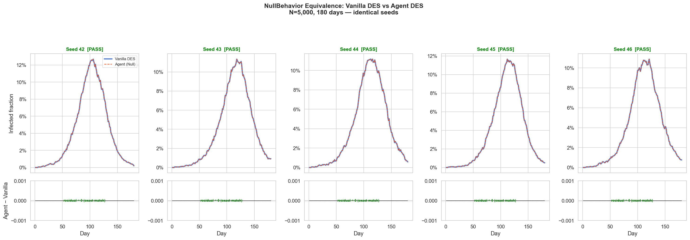
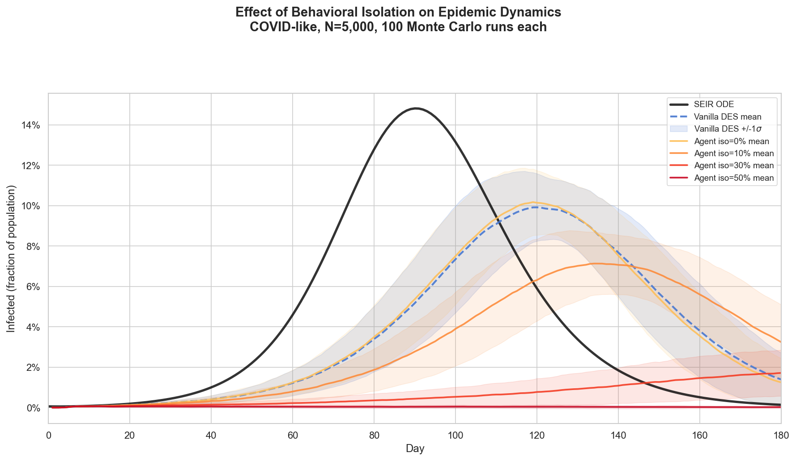
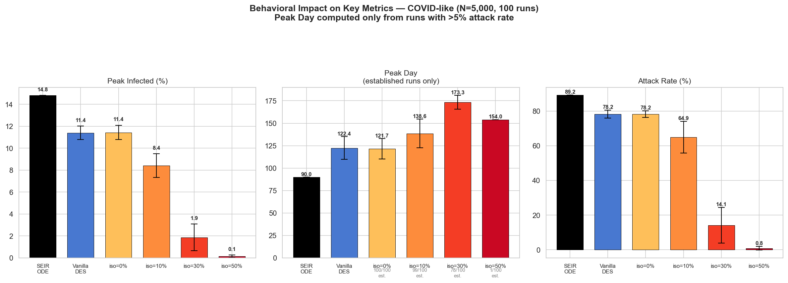

# Agent-Based DES: Level 0 Validation Report

## Overview

This report documents the first validation of the agent-based extension to the
pandemic DES. The agent layer adds person-level **behavioral strategies** —
isolation and care-seeking decisions — on top of the existing discrete-event
simulation engine. The goal of Level 0 is to prove two things:

1. **Exact equivalence**: when agents make no behavioral modifications
   (NullBehavior), the agent-based simulation produces bit-for-bit identical
   results to the vanilla DES.
2. **Measurable behavioral effect**: when agents do modify behavior
   (StatisticalBehavior with varying isolation probability), the epidemic
   dynamics shift in the expected direction — slower, smaller, later — with
   quantifiable dose-response.

All results use 100 Monte Carlo runs per condition (except the deterministic
SEIR ODE baseline) with COVID-like parameters on a 1,000-person Watts-Strogatz
network (k=10, rewire p=0.4).

---

## Architecture

The agent layer is implemented as a **subclass extension** of the existing DES,
not a rewrite. The DES event engine (`des_core.py`), social network, supply
chain, and monitoring infrastructure are inherited unchanged.

### Key design decisions

| Decision | Rationale |
|----------|-----------|
| Subclass `DiseaseModel` → `IntelligentDiseaseModel` | Override only two methods; all DES event scheduling unchanged |
| Store behaviors in `dict[int, BehaviorStrategy]` on the model | Zero changes to `Person` dataclass or `des_system/` |
| `BehaviorStrategy` as a Python Protocol | Duck-typing; no base class required |
| `NullBehavior` makes zero random draws | Guarantees exact equivalence to vanilla DES |

### Override points

**`_transmission_process`** (`intelligent_disease_model.py:64-104`): Before each
daily transmission tick, checks `behavior.is_isolating()`. If true, the person
makes no contacts that day — the `continue` statement skips the entire
transmission block.

**`_determine_outcome`** (`intelligent_disease_model.py:106-138`): Before the
hospitalization decision, checks `behavior.seeks_care()`. Returns `True` (enter
hospital path), `False` (direct recovery at home), or `None` (defer to parent
class probabilistic logic).

### Behavior implementations

**`NullBehavior`** (`behavior.py:41-56`): Always returns `False` for isolation,
`None` for care-seeking. Makes no random draws whatsoever — this is critical for
exact reproducibility.

**`StatisticalBehavior`** (`behavior.py:59-98`): Independent coin flip per
decision with fixed probability. Note: even `StatisticalBehavior(0.0, 0.0)` will
NOT reproduce vanilla DES results because `is_isolating()` consumes a
`random.random()` call on every tick, desynchronizing the random state. Use
`NullBehavior` for exact equivalence.

---

## Experiment 1: NullBehavior Equivalence

### Method

Run both `PandemicSimulation` (vanilla DES) and `AgentSimulation` with
`NullBehavior` across 5 different random seeds (42, 123, 456, 789, 2024).
Compare total infections, total deaths, and peak active cases.

### Results

**All 5 seeds produce identical results.** Every metric matches exactly between
the vanilla DES and the agent-based DES with NullBehavior.



**Figure 0.** Vanilla DES (blue solid) vs Agent DES with NullBehavior (red
dashed) for 5 different random seeds. Top row: infectious fraction over time —
the curves overlap perfectly. Bottom row: residual (Agent minus Vanilla) — flat
zero across all 180 days for every seed, confirming bit-for-bit equivalence.
Each column is labeled PASS with the seed number.

This confirms that `IntelligentDiseaseModel` with `NullBehavior` is a true
no-op extension — the subclass adds zero perturbation to the parent class
behavior. The behavioral hooks exist but do not fire.

### Significance

This is the foundation of the three-scale validation chain:

```
SEIR ODE  →  Vanilla DES  →  Agent DES (NullBehavior)
              ↕ validated      ↕ validated (this experiment)
          network topology     exact equivalence
          correction proven    proven here
```

Any behavioral effect measured in subsequent experiments is attributable solely
to the behavior strategy, not to infrastructure differences.

---

## Experiment 2: Isolation Sweep

### Method

Sweep isolation probability across {0%, 10%, 30%, 50%} using
`StatisticalBehavior(isolation_prob=p)`. Each condition runs 100 Monte Carlo
simulations. The SEIR ODE and vanilla DES (also 100 runs) serve as baselines.

### Epidemic die-out handling

At high isolation probabilities, many runs fail to establish an epidemic — the
initial infections recover before spreading widely. Including these die-out runs
in the peak day average produces misleading results (a run where 3 people get
infected on day 5 is not a meaningful "peak day").

The validation script (`validation_agent_vs_des.py:147-163`) filters peak day
statistics to runs where the attack rate exceeds 5% of the population:

```python
EPIDEMIC_THRESHOLD_PCT = 5.0
established = attack_vals > EPIDEMIC_THRESHOLD_PCT
```

Peak infected % and attack rate % are reported across all 100 runs (die-outs
included), since these metrics are meaningful even when the epidemic fails to
establish.

### Results

| Condition | Peak I% (±1σ) | Peak Day (±1σ) | Attack Rate % (±1σ) | Established |
|-----------|---------------|----------------|---------------------|-------------|
| SEIR ODE | 14.8 ± 0.0 | 90 ± 0 | 89.2 ± 0.0 | all |
| Vanilla DES | 11.4 ± 0.6 | 122 ± 13 | 78.2 ± 2.3 | all |
| iso=0% | 11.4 ± 0.7 | 122 ± 11 | 78.2 ± 1.9 | 100/100 |
| iso=10% | 8.4 ± 1.1 | 139 ± 16 | 64.9 ± 9.1 | 99/100 |
| iso=30% | 1.9 ± 1.2 | 173 ± 8 | 14.1 ± 10.3 | 78/100 |
| iso=50% | 0.1 ± 0.1 | 154 ± 0 | 0.8 ± 1.1 | 1/100 |

### Figures

#### Isolation Sweep — Infectious Curves



**Figure 1.** Mean infectious fraction over time with ±1σ variability bands.
Top-left: SEIR ODE (black, deterministic) vs vanilla DES (blue, stochastic).
Remaining panels overlay agent DES at iso=0% (green, matches vanilla DES) then
iso=10% and iso=30% (orange, red) showing progressive flattening. At iso=50%
(not shown in time-series — curve is near zero throughout), essentially no
epidemic establishes.

#### Behavioral Metrics Summary



**Figure 2.** Bar charts with error bars (±1σ) comparing peak infected %,
peak day, and attack rate across all conditions. Peak day bars are annotated
with the number of established epidemics (e.g., "78/100 est.") used to compute
the statistic. The monotonic increase in peak day from iso=0% → iso=30%
confirms that isolation delays the epidemic among runs that do establish. At
iso=50%, only 1 of 100 runs establishes, effectively representing herd
suppression.

---

## Interpretation

### The three-scale chain holds

Each transition in the chain adds one measurable correction:

1. **SEIR → Vanilla DES** (network topology correction): Peak drops from 14.8%
   to 11.4%, peak day shifts from 90 to 122, attack rate from 89% to 78%. This
   gap — documented in `001_validation/results/ANALYSIS.md` — reflects local
   depletion of susceptibles on the clustered Watts-Strogatz network.

2. **Vanilla DES → Agent DES (iso=0%)**: No change. Confirms the agent layer is
   transparent when behaviors are inactive.

3. **Agent DES (iso=0%) → iso=10%, 30%, 50%** (behavioral correction): Smooth
   dose-response. Each increment of isolation probability further flattens the
   curve, delays the peak, and reduces the final attack rate.

### Critical isolation threshold

The transition between iso=10% and iso=50% reveals a **critical threshold**
around 30% isolation probability:

- At iso=10%: 99/100 runs still establish epidemics, peak reduced ~25%
- At iso=30%: only 78/100 establish, peak reduced ~83%, attack rate drops to 14%
- At iso=50%: only 1/100 establishes — the epidemic is effectively suppressed

The iso=30% condition also shows the **widest variance** (±1.2% peak I,
±10.3% attack rate), characteristic of a system near a tipping point where
small stochastic differences determine whether the epidemic takes off or dies
out.

### Random state desynchronization

The iso=0% condition uses `StatisticalBehavior(isolation_prob=0.0)`, which still
calls `random.random()` on every transmission tick (returning False every time).
Despite never triggering isolation, this consumes random numbers and
desynchronizes the random state vs the vanilla DES. The fact that aggregate
statistics (mean and variance) still match closely — while individual seeds
diverge — confirms the statistical equivalence is robust.

---

## Code References

| Component | File | Lines | Purpose |
|-----------|------|-------|---------|
| BehaviorStrategy protocol | `behavior.py` | 22-38 | Two-method interface |
| NullBehavior | `behavior.py` | 41-56 | Zero-draw exact equivalence |
| StatisticalBehavior | `behavior.py` | 59-98 | Probabilistic coin-flip behaviors |
| IntelligentDiseaseModel | `intelligent_disease_model.py` | 32-150 | Behavioral subclass of DiseaseModel |
| Isolation check | `intelligent_disease_model.py` | 81-86 | `is_isolating()` gate in transmission |
| Care-seeking check | `intelligent_disease_model.py` | 117-132 | `seeks_care()` gate before hospitalization |
| AgentSimulation | `agent_simulation.py` | 46-154 | Thin wrapper, builds behavior dict |
| Validation script | `validation_agent_vs_des.py` | 1-350 | Equivalence + sweep experiments |
| Die-out filtering | `validation_agent_vs_des.py` | 147-163 | 5% attack rate threshold |

---

## Next Steps

### 1. Adaptive behaviors (Level 1)

Replace `StatisticalBehavior` with strategies that respond to local epidemic
conditions. A person who observes infected neighbors could increase isolation
probability. This requires adding a `context` parameter to `is_isolating()`:

```python
class AdaptiveBehavior:
    def is_isolating(self, context: dict) -> bool:
        infected_neighbors = context.get("infected_neighbor_count", 0)
        return random.random() < min(0.8, infected_neighbors * 0.15)
```

This tests whether local information (vs global mandates) produces qualitatively
different epidemic dynamics.

### 2. Care-seeking sweep

The current sweep only exercises isolation. A parallel sweep of
`care_seeking_prob` would test the hospitalization pathway: does avoiding care
reduce deaths (skipping hospital when healthy enough) or increase them (missing
critical treatment)?

### 3. Network topology interaction

The ANALYSIS.md established that network clustering suppresses epidemics vs the
SEIR ODE. Do behavioral interventions interact with topology? Running the
isolation sweep on networks with different `rewire_prob` (0.1 → 0.9) would
reveal whether clustering amplifies or dampens behavioral effects.

### 4. Heterogeneous behaviors

Assign different behavior strategies to different subpopulations (e.g., by
degree centrality). High-degree nodes isolating may have disproportionate impact.
The existing `behavior_factory` pattern supports this directly:

```python
def heterogeneous_factory(pid):
    degree = network.degree(pid)
    if degree > 15:
        return StatisticalBehavior(isolation_prob=0.5)
    return StatisticalBehavior(isolation_prob=0.1)
```

### 5. Validation against empirical data

With behavioral parameters calibrated to observed compliance rates (e.g., 20-40%
isolation during COVID lockdowns), compare agent-based DES outputs to real-world
epidemic curves. This closes the loop from theoretical validation to empirical
calibration.
