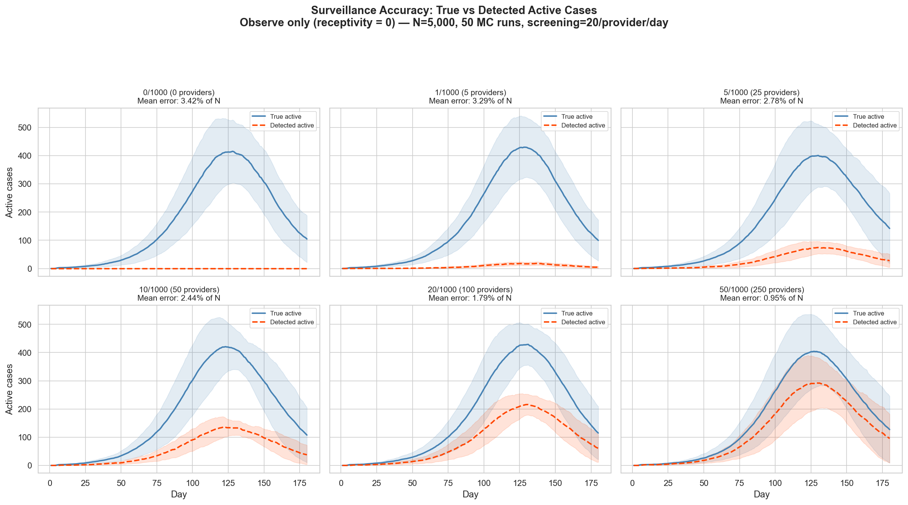
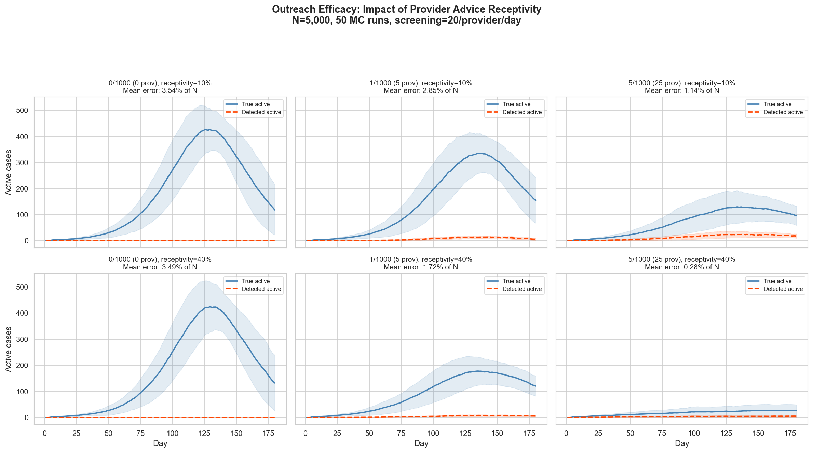
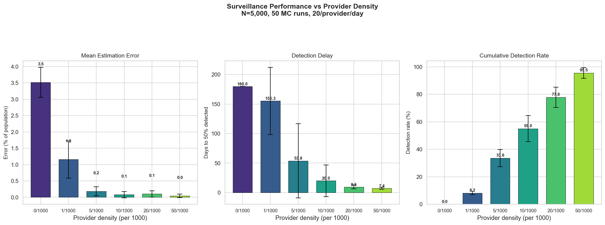
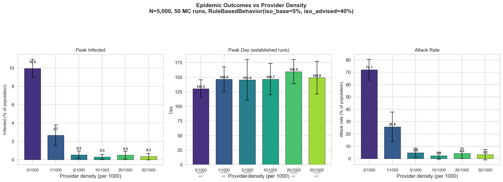

# Healthcare Provider Impact: Level 0 Validation Report

## Overview

This report documents the impact of healthcare providers on pandemic
surveillance accuracy and epidemic outcomes. Providers screen the population
daily, detecting sick individuals (improving the healthcare system's estimate
of the true sickness rate) and advising people (boosting isolation and
care-seeking compliance).

The core finding: **more providers → dramatically better surveillance AND
reduced epidemic severity**, establishing the foundation for personalized
pandemic response agents.

All results use 50 Monte Carlo runs per condition, N=5,000 on a Watts-Strogatz
network, COVID-like parameters, 180-day simulations.

---

## Architecture

### Three new components

| Component | File | Role |
|-----------|------|------|
| `RuleBasedBehavior` | `rule_based_behavior.py` | Level 1 person behavior with provider responsiveness |
| `StatisticalProvider` | `provider.py` | Level 0 provider: random screening, detection, advice |
| `HealthcareSystem` | `healthcare_system.py` | Passive surveillance tracker (detected vs true) |

### How they interact

Each day, as a parallel DES process (`provider_simulation.py:135-150`):

1. Each provider randomly samples 20 people from the population
2. For each person screened:
   - **Detection**: if person is contagious AND discloses symptoms (P=0.5) →
     healthcare system records the case
   - **Advice**: provider advises the person; if receptive (P=0.6) →
     person's isolation probability jumps from 5% to 40%
3. Healthcare system records daily snapshot: detected active vs true active

The disease model runs unchanged — providers observe and influence behavior,
they do not modify disease mechanics.

### Person behavior parameters

| Parameter | Value | Description |
|-----------|-------|-------------|
| `disclosure_prob` | 0.5 | P(reveal symptoms when asked) |
| `receptivity` | 0.6 | P(follow provider advice) |
| `base_isolation_prob` | 0.05 | Isolation without advice |
| `advised_isolation_prob` | 0.40 | Isolation after accepting advice |
| `base_care_prob` | 0.0 | Care-seeking without advice (defer to default) |
| `advised_care_prob` | 0.5 | Care-seeking after accepting advice |

### Provider density sweep

| Density (per 1000) | Providers | Daily screening capacity | Daily coverage |
|--------------------|-----------|------------------------|----------------|
| 0 | 0 | 0 | 0% |
| 1 | 5 | 100 | 2% |
| 5 | 25 | 500 | 10% |
| 10 | 50 | 1,000 | 20% |
| 20 | 100 | 2,000 | 40% |
| 50 | 250 | 5,000 | 100% |

---

## Results

### Summary table

| Density | Est Error (% of N) | Detection Delay (days) | Cumulative Det Rate | Peak I% | Peak Day | Attack Rate % |
|---------|--------------------|-----------------------|--------------------|---------|----------|---------------|
| 0/1000 | 3.52 | 180 (never) | 0.0% | 10.0 | 130 | 72.1 |
| 1/1000 | 1.16 | 155 | 8.2% | 2.7 | 147 | 25.8 |
| 5/1000 | 0.18 | 54 | 33.6% | 0.5 | 145 | 4.8 |
| 10/1000 | 0.08 | 20 | 55.0% | 0.3 | 147 | 2.4 |
| 20/1000 | 0.10 | 10 | 77.8% | 0.5 | 160 | 4.3 |
| 50/1000 | 0.04 | 7 | 95.5% | 0.3 | 149 | 3.2 |

---

### Figure 1: Surveillance Accuracy (Observe Only)



**Figure 1.** True active cases (blue solid) vs detected active cases (orange
dashed) with ±1σ bands across 50 MC runs. Providers **observe only**
(receptivity = 0): they detect cases but do not change behavior. The true
epidemic curve is nearly identical across all densities (~400 peak active),
confirming that observation alone does not alter disease dynamics. The detected
curve grows with provider density: at 50/1000, detection tracks roughly half
the true peak (mean error 0.95% of N). This isolates the pure surveillance
effect from behavioral modification.

### Figure 2: Outreach Efficacy



**Figure 2.** Same layout but now providers **advise** and people may follow.
Top row: receptivity = 10%. Bottom row: receptivity = 40%. Columns: 0, 1, 5
providers per 1000. At 0/1000 (left column), both rows show the same
unmodified epidemic (~420 peak) — a built-in control confirming that
receptivity has no effect without providers. Moving right, higher receptivity
dramatically suppresses the true epidemic: at 5/1000 with 40% receptivity, the
peak drops from ~400 to ~30 active cases. This demonstrates that the
behavioral modification channel (advice → isolation) is the dominant mechanism
for epidemic reduction, not surveillance alone.

### Figure 3: Surveillance Metrics



**Figure 3.** Three surveillance performance metrics by provider density
(default behavior, receptivity = 60%). Left: mean estimation error drops from
~3.5% to 0.04% of the population. Center: detection delay (days until ≥50% of
true cases detected) drops from 180 days (never achieved) to ~7 days. Right:
cumulative detection rate rises from 0% to 95.5%.

### Figure 4: Epidemic Outcomes



**Figure 4.** Epidemic severity metrics by provider density (default behavior,
receptivity = 60%). Peak infected % drops from 10% to <0.5%. Attack rate drops
from 72% to 2.4–4.8%. The mechanism: providers advise people → receptive
people isolate at 40% instead of 5% → transmission chains break. Even 5
providers per 1000 (2% daily screening coverage) reduces the attack rate by
93%.

---

## Interpretation

### The dual effect of providers

Providers produce two simultaneous benefits, now cleanly separated by Figures
1 and 2:

1. **Surveillance** (Figure 1): By screening and detecting cases, the
   healthcare system builds an increasingly accurate picture of the epidemic.
   With receptivity = 0 (observe only), the true epidemic is unchanged across
   all densities, but detected cases grow with provider count. At 50/1000, the
   system detects roughly half the active cases in real time (mean error 0.95%
   of N).

2. **Behavioral modification** (Figure 2): By advising screened people,
   providers shift isolation probability from 5% to 40% for receptive
   individuals. This is the dominant mechanism for epidemic reduction. At
   5/1000 with 40% receptivity, the true epidemic peak drops from ~400 to ~30
   active cases — a 13× reduction. The 0/1000 column serves as a built-in
   control: identical curves regardless of receptivity, confirming that the
   effect requires both providers and receptivity.

### Non-linear dose-response

The epidemic impact shows strong non-linearity:

- **0 → 1/1000**: Attack rate drops from 72% to 26% (64% reduction)
- **1 → 5/1000**: Attack rate drops from 26% to 4.8% (82% further reduction)
- **5 → 50/1000**: Marginal improvement (4.8% → 3.2%)

This suggests a **critical threshold around 5 providers per 1000** (10% daily
screening coverage) beyond which the behavioral modification alone is
sufficient to suppress the epidemic. Additional providers improve surveillance
accuracy but add diminishing epidemiological benefit.

### The baseline behavioral effect

Even at density=0 (no providers), the epidemic is somewhat reduced compared to
the vanilla DES (attack rate 72% vs 78% in the prior agent_based_des results).
This is because `RuleBasedBehavior` has `base_isolation_prob=0.05`, providing
a small but non-zero baseline isolation effect.

### Connection to the parameter table

The provider simulation demonstrates impact on several target parameters:

| Parameter | Symbol | Baseline → Provider-Enhanced | Evidence |
|-----------|--------|------------------------------|----------|
| Symptom Reporting Rate | ρ_sx | 0% → 95.5% (at 50/1000) | Cumulative detection rate |
| Quarantine Compliance | c_q | 5% → 40% (advised) | `advised_isolation_prob` |
| Health Info Accuracy | α_info | None → daily snapshot | Surveillance accuracy figure |
| Time to Care | τ_care | default → `advised_care_prob=0.5` | Care-seeking behavioral shift |

The parameters for **contact tracing efficacy** (ε_ct), **time to contact
notification** (τ_contact), and **vaccine uptake** (v_uptake) are not yet
modeled but represent natural Level 1+ extensions.

---

## Code References

| Component | File | Lines | Purpose |
|-----------|------|-------|---------|
| RuleBasedBehavior | `rule_based_behavior.py` | 18-99 | Level 1 person behavior |
| Disclosure check | `rule_based_behavior.py` | 75-77 | `would_disclose()` coin flip |
| Advice acceptance | `rule_based_behavior.py` | 79-88 | `receive_advice()` sets `_provider_advised` |
| Isolation decision | `rule_based_behavior.py` | 63-66 | Uses advised_prob if flag set |
| StatisticalProvider | `provider.py` | 17-82 | Level 0 screening logic |
| HealthcareSystem | `healthcare_system.py` | 11-79 | Surveillance tracking |
| Detection accuracy | `healthcare_system.py` | 43-62 | Daily detected_active vs true_active |
| ProviderSimulation | `provider_simulation.py` | 60-225 | Extended simulation class |
| Screening process | `provider_simulation.py` | 135-150 | Daily parallel DES generator |
| Surveillance record | `provider_simulation.py` | 152-178 | Daily surveillance in _daily_monitor |
| Validation script | `validation_providers.py` | 1-607 | Three-phase sweep + 4 figures |

---

## Next Steps

### 1. Contact tracing (ε_ct, τ_contact)

When a provider detects a case, trace their network contacts and advise them
proactively. This targets the highest-value parameter: contact tracing efficacy.

```python
class TracingProvider(StatisticalProvider):
    def screen_daily(self, people, behaviors, healthcare_system, time):
        stats = super().screen_daily(...)
        # For each newly detected case, advise their network contacts
        for pid in newly_detected:
            for contact_id in people[pid].contacts:
                behaviors[contact_id].receive_advice()
```

### 2. Adaptive provider targeting (Level 1 provider)

Replace random screening with targeted screening: prioritize neighborhoods with
recent detections, high-degree network nodes, or areas with low advised rates.

### 3. Information network effects

Model information spreading through the social network: when a person is
advised, they may share that information with contacts (even without a
provider), creating cascading behavioral change.

### 4. The personalized agent limit

The logical extreme of increasing provider density is 1:1 coverage — each
person has their own health advisor. This is the **personalized pandemic agent
AI** scenario. The 50/1000 results (95.5% detection, 3.2% attack rate)
suggest that even well below 1:1, the system achieves near-optimal outcomes.
The question becomes: what additional benefit does personalization provide
beyond population-level screening?

### 5. Heterogeneous populations

Vary `disclosure_prob` and `receptivity` across the population (e.g., by age
group or network position) to model realistic behavioral heterogeneity. This
tests whether providers can overcome uneven compliance.
