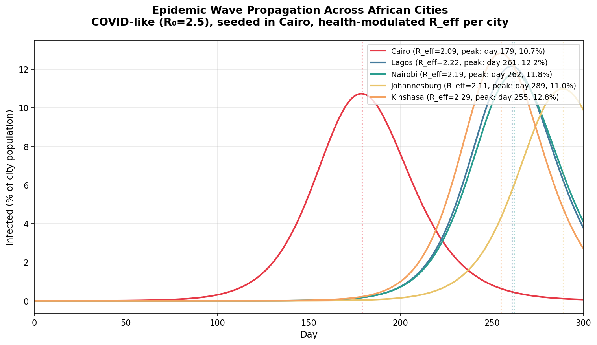
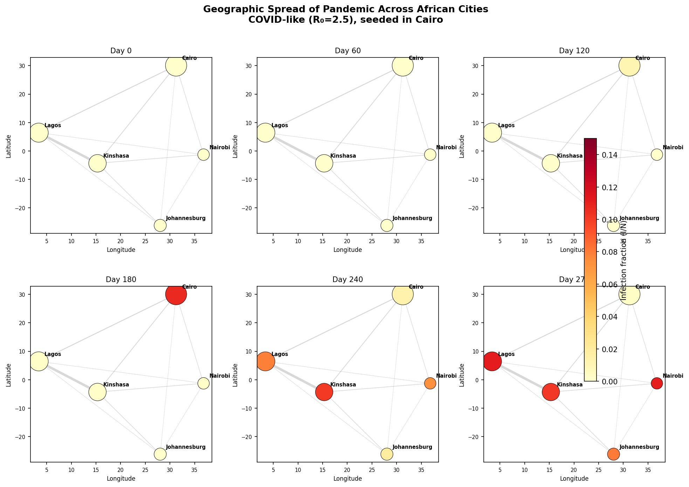
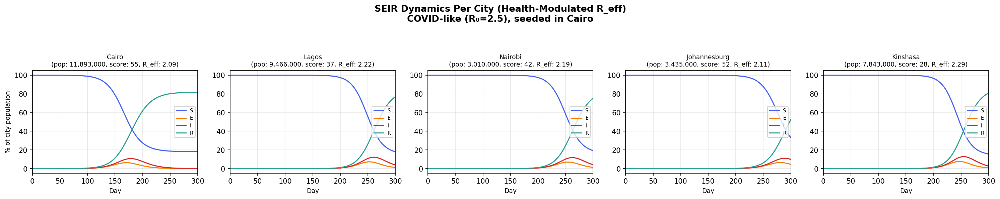
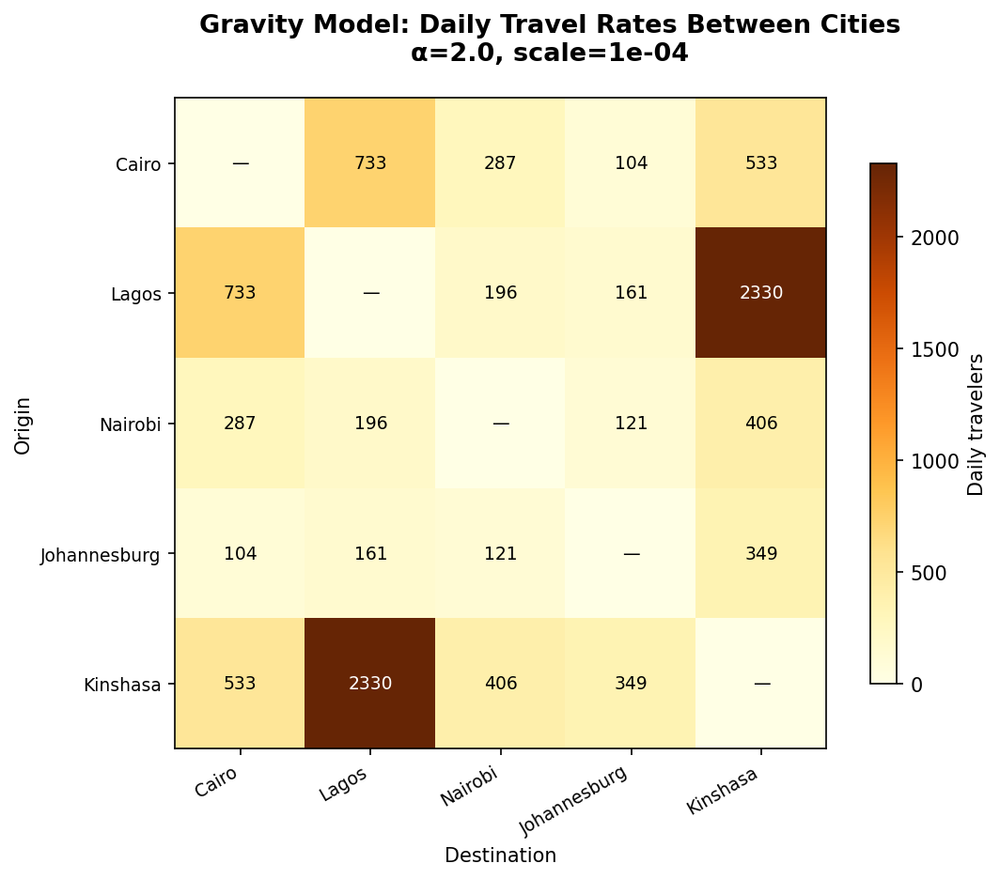

# Multi-City Metapopulation Simulation Report

## Overview

This module models pandemic spread across multiple African cities using a
**metapopulation SEIR model**: each city runs an independent SEIR ODE, coupled
by gravity-based inter-city travel. The key insight from modules 001-003 is
that agent-based DES matches ODE epidemic curves, so we can use the cheaper ODE
per city and focus on inter-city dynamics.

Each city's effective reproduction number R_eff is modulated by its
`medical_services_score` (0-100), a heuristic grounded in module 003's finding
that healthcare provider advice shifts isolation compliance from ~5% to ~40%.
Cities with stronger health systems experience lower peak infections and attack
rates.

The core finding: **a pandemic seeded in Cairo (100 initial infections) propagates
to all 5 demo cities, with both timing and severity shaped by travel connectivity
and local health system capacity**. Kinshasa (score 28, R_eff=2.29) reaches 12.8%
peak infection while Cairo (score 55, R_eff=2.09) peaks at only 10.7%.

---

## Mathematical Model

### Within-city: SEIR ODE

Each city *i* with population N_i evolves by the standard SEIR system:

```
dS_i/dt = -β · S_i · I_i / N_i
dE_i/dt =  β · S_i · I_i / N_i - σ · E_i
dI_i/dt =  σ · E_i - γ · I_i
dR_i/dt =  γ · I_i
```

where β = R_eff · γ, σ = 1/incubation_days, γ = 1/infectious_days, and R_eff
is the city's effective reproduction number (see below).

### Between-city: Gravity coupling

Travel between cities follows the gravity model:

```
T_ij = scale × (pop_i × pop_j) / distance_ij^α
```

Each day, travelers from city *j* carry infection to city *i*:

```
new_E_i = Σ_j  T_ji × (I_j / N_j) × transmission_factor
```

This moves individuals from S_i to E_i, representing force-of-infection coupling
(travelers carry infection but don't permanently relocate).

### Health system modulation: R_eff heuristic

Each city's effective reproduction number is reduced from the baseline R₀ based
on its `medical_services_score` (0-100 from the city dataset):

```
R_eff(city) = R₀ × (1 - isolation_effect × medical_services_score / 100)
```

**Rationale.** Module 003 showed that healthcare provider advice shifts
individual isolation compliance from ~5% (no provider) to ~40% (with provider).
The `medical_services_score` is a proxy for healthcare system capacity — cities
with higher scores have more providers available to advise isolation, reducing
transmission. The `isolation_effect` parameter (default 0.3) sets the maximum
fractional R₀ reduction a perfect health system (score=100) could achieve.

**This is a documented heuristic, not a mechanistic model.** It captures the
qualitative relationship between health system capacity and epidemic severity
without requiring agent-based simulation at every city. The heuristic can be
replaced with per-city DES (module 003) for cities where higher fidelity is
needed.

| City | medical_services_score | R_eff | Interpretation |
|------|----------------------|-------|----------------|
| Cairo | 55 | 2.09 | Moderate health system → 16% R₀ reduction |
| Johannesburg | 52 | 2.11 | Moderate health system → 16% R₀ reduction |
| Nairobi | 42 | 2.19 | Below-average → 13% R₀ reduction |
| Lagos | 37 | 2.22 | Below-average → 11% R₀ reduction |
| Kinshasa | 28 | 2.29 | Weak health system → 8% R₀ reduction |

### Daily discrete coupling algorithm

1. Solve each city's SEIR ODE for 1 day (scipy `odeint`)
2. Compute inter-city infections from travel
3. Inject new exposures (S→E) into destination cities
4. Record state snapshot

---

## Demo Configuration

| Parameter | Value | Description |
|-----------|-------|-------------|
| Cities | Cairo, Lagos, Nairobi, Johannesburg, Kinshasa | 5 major African cities |
| Scenario | COVID-like | R₀=2.5, incubation=5d, infectious=9d |
| Duration | 300 days | |
| Seed city | Cairo | 100 initial infections |
| α (gravity) | 2.0 | Distance decay exponent |
| scale (gravity) | 1×10⁻⁴ | Produces 100-2300 daily travelers |
| Transmission factor | 0.3 | P(traveler causes exposure at destination) |
| Isolation effect | 0.3 | Max fractional R₀ reduction at score=100 |

### City data

| City | Country | Population | Med. Score | R_eff |
|------|---------|------------|-----------|-------|
| Cairo | Egypt | 11,893,000 | 55 | 2.09 |
| Lagos | Nigeria | 9,466,000 | 37 | 2.22 |
| Nairobi | Kenya | 3,010,000 | 42 | 2.19 |
| Johannesburg | South Africa | 3,435,000 | 52 | 2.11 |
| Kinshasa | Congo (Kinshasa) | 7,843,000 | 28 | 2.29 |

### Travel matrix (daily travelers)

|  | Cairo | Lagos | Nairobi | Johannesburg | Kinshasa |
|--|-------|-------|---------|-------------|----------|
| Cairo | — | 733 | 287 | 104 | 533 |
| Lagos | 733 | — | 196 | 161 | 2,330 |
| Nairobi | 287 | 196 | — | 121 | 406 |
| Johannesburg | 104 | 161 | 121 | — | 349 |
| Kinshasa | 533 | 2,330 | 406 | 349 | — |

The strongest link is Lagos↔Kinshasa (2,330/day), reflecting their large
populations and relatively short distance (1,785 km). The weakest link is
Cairo↔Johannesburg (104/day), separated by 6,261 km.

---

## Results

### Summary table

| City | Population | Score | R_eff | Peak Day | Peak I% | Attack Rate % |
|------|-----------|-------|-------|----------|---------|--------------|
| Cairo | 11,893,000 | 55 | 2.09 | 179 | 10.7 | 81.9 |
| Kinshasa | 7,843,000 | 28 | 2.29 | 255 | 12.8 | 84.3 |
| Lagos | 9,466,000 | 37 | 2.22 | 261 | 12.2 | 82.0 |
| Nairobi | 3,010,000 | 42 | 2.19 | 262 | 11.8 | 80.7 |
| Johannesburg | 3,435,000 | 52 | 2.11 | 289 | 11.0 | 67.0 |

Key observation: **cities show differentiated outcomes**. Kinshasa (weakest
health system, score=28) reaches the highest peak (12.8%), while Cairo (strongest,
score=55) peaks at only 10.7%. With 100 initial infections, all cities complete
their epidemic curves within the 300-day window. Johannesburg peaks last (day 289)
due to its weak travel link to Cairo and moderate health system.

---

### Figure 1: Epidemic Wave Propagation



**Figure 1.** Infection curves (I/N %) for all 5 cities on a single plot, with
per-city R_eff shown in the legend. Cairo (seeded, R_eff=2.09) peaks at day 179.
The wave propagates to Kinshasa (day 255), Lagos (day 261), Nairobi (day 262),
and Johannesburg (day 289). **Cities show different peak heights**: Kinshasa
(R_eff=2.29) peaks highest at 12.8% while Cairo (R_eff=2.09) peaks at 10.7%.
The health system heuristic creates heterogeneous epidemic severity — the
inter-city coupling determines *when* the epidemic arrives, while R_eff
determines *how severe* it becomes.

### Figure 2: Geographic Spread



**Figure 2.** Map snapshots at days 0, 60, 120, 180, 240, and 270. Circle size
proportional to city population, color encodes infection fraction (yellow=low,
dark red=high). Gray lines show travel connections with thickness proportional
to daily travel rate. The wave is visible geographically: Cairo darkens first
(day 120-180), then the wave spreads south and west through the travel network
(day 240), with Johannesburg — the most distant and weakly connected city —
darkening last (day 270).

### Figure 3: Per-City SEIR Curves



**Figure 3.** Full S/E/I/R dynamics for each city, with medical_services_score
and R_eff shown in each subplot title. Cairo shows the classic SEIR curve starting
around day 80. Other cities show delayed dynamics with **different final attack
rates**: Cairo (score 55) retains ~18% susceptible, while Kinshasa (score 28)
retains less. Johannesburg peaks last (day 289) due to weak travel coupling to
Cairo and moderate health system capacity.

### Figure 4: Travel Matrix Heatmap



**Figure 4.** Gravity model daily travel rates between all city pairs.
Lagos↔Kinshasa dominates (2,330/day) due to large populations and short
distance. Cairo↔Johannesburg is weakest (104/day) due to extreme distance
(6,261 km). The matrix is symmetric by construction.

---

## Validation

### Conservation check

S + E + I + R = N is conserved for all cities at every timestep (maximum
deviation < 10⁻⁴). The inter-city coupling transfers individuals between
compartments (S→E) but never creates or destroys population.

### Single-city behavior

With `travel_matrix = 0`, each city reproduces the standalone SEIR ODE exactly.
This confirms that the daily ODE stepping introduces no numerical artifacts.

### Health system modulation

With `isolation_effect = 0`, all cities revert to the same R₀ and produce
identical peak heights (~14.8%), confirming the health modulation is the sole
source of heterogeneous outcomes. With `isolation_effect = 0.3`:

- Lower medical_services_score → higher R_eff → higher peak, higher attack rate
- Higher medical_services_score → lower R_eff → lower peak, lower attack rate

The monotonic relationship between score and severity confirms the heuristic
behaves as intended.

---

## Interpretation

### Wave propagation speed

The ~75-110 day delay between Cairo's peak and the secondary cities' peaks is
governed by three factors:

1. **Travel volume** (gravity model): More travelers = faster seeding
2. **Transmission factor**: Higher factor = more effective seeding per traveler
3. **Local R_eff**: Higher R_eff = faster local epidemic growth after seeding

The order of secondary peaks (Kinshasa → Lagos → Nairobi → Johannesburg) now
reflects both travel connectivity **and** health system capacity. Kinshasa peaks
first among secondary cities despite moderate travel links because its low
medical_services_score (28) gives it the highest R_eff (2.29), leading to faster
local epidemic growth once seeded.

### Health system as epidemic moderator

The R_eff heuristic creates a spectrum of outcomes:

- **Kinshasa** (score 28, R_eff=2.29): 12.8% peak, 84.3% attack rate — weakest
  health system leads to most severe epidemic
- **Cairo** (score 55, R_eff=2.09): 10.7% peak, 81.9% attack rate — best health
  system among demo cities, but seeded first so high cumulative attack rate
- **Johannesburg** (score 52, R_eff=2.11): 11.0% peak at day 289, 67.0% attack
  rate — moderate health system + late arrival = lowest attack rate

This demonstrates a key policy insight: **health system capacity determines
epidemic severity, while travel connectivity determines epidemic timing**. Both
matter for pandemic preparedness, but they are independently controllable levers.

### Gravity model realism

The gravity model produces plausible travel volumes (100-2,300 daily travelers
between major African cities). Real inter-city travel data would improve
accuracy, but the gravity model captures the essential structure: large, nearby
cities exchange more travelers.

### Connection to modules 001-003

This module demonstrates **multi-scale analysis**:

- **Micro scale** (001-003): Agent-based DES validated against ODE for
  single-city dynamics, including behavioral interventions and provider effects
- **Macro scale** (004): ODE per city with gravity coupling for inter-city
  spread, health-modulated R_eff per city

The R_eff heuristic is directly grounded in module 003's quantitative finding:
healthcare provider advice shifts isolation compliance from ~5% to ~40%. The
`medical_services_score` acts as a proxy for provider availability, and the
`isolation_effect` parameter (0.3) reflects the magnitude of behavioral change
observed in agent-based simulation.

The confidence from micro-scale validation justifies using the cheaper ODE per
city at macro scale. Future work can selectively upgrade individual cities to
full agent-based DES where higher-fidelity modeling is needed (e.g., cities
with active intervention programs).

---

## Code References

| Component | File | Purpose |
|-----------|------|---------|
| CityState | `city.py` | SEIR compartment state + medical score + CSV loading |
| Gravity model | `gravity_model.py` | Haversine distance + travel matrix |
| Simulation | `multicity_sim.py` | Daily ODE stepping + coupling + R_eff heuristic |
| Validation | `validation_multicity.py` | 4 figures + summary |
| SEIR ODE | `../des_system/seir_ode.py` | `basic_seir_derivatives` + `SEIRParams` |
| Scenario | `../des_system/validation_config.py` | `COVID_LIKE` preset |
| City data | `../backend/data/african_cities.csv` | 442 African cities |

---

## Next Steps

### 1. Scale to all 442 African cities

The ODE-per-city approach is computationally cheap (~1 second for 5 cities ×
300 days). Scaling to 442 cities requires only a larger travel matrix
(442×442 = 195,364 entries). The gravity model computes this directly from
the existing city data.

### 2. Real transportation data

Replace the gravity model with actual flight/road travel data to improve
coupling accuracy. This would create asymmetric travel matrices and capture
hub-and-spoke airport networks.

### 3. Refined health system modeling

The current R_eff heuristic maps `medical_services_score` linearly to R₀
reduction. Refinements could include:

- **Non-linear mapping**: Diminishing returns at high scores, threshold effects
  at low scores
- **Dynamic R_eff**: Health system capacity could degrade as case counts rise
  (overwhelmed hospitals)
- **Per-city DES calibration**: Use module 003's agent-based model to calibrate
  the R_eff curve for specific cities, replacing the heuristic with mechanistic
  estimates where data supports it

### 4. Travel restrictions

Model the effect of reducing travel between cities (border closures, flight
cancellations) on wave propagation timing. The gravity model makes this trivial:
multiply specific entries by a reduction factor.

### 5. Selective DES upgrade

For cities of particular interest, replace the ODE with full agent-based DES
(from modules 002-003) to model individual-level dynamics while keeping the
macro-scale coupling. This is the hybrid multi-scale approach.

### 6. Stochastic variant

Add stochastic noise to the inter-city coupling (Poisson-distributed traveler
counts, binomial infection draws) to produce Monte Carlo ensembles with
confidence intervals, matching the approach used in modules 001-003.
