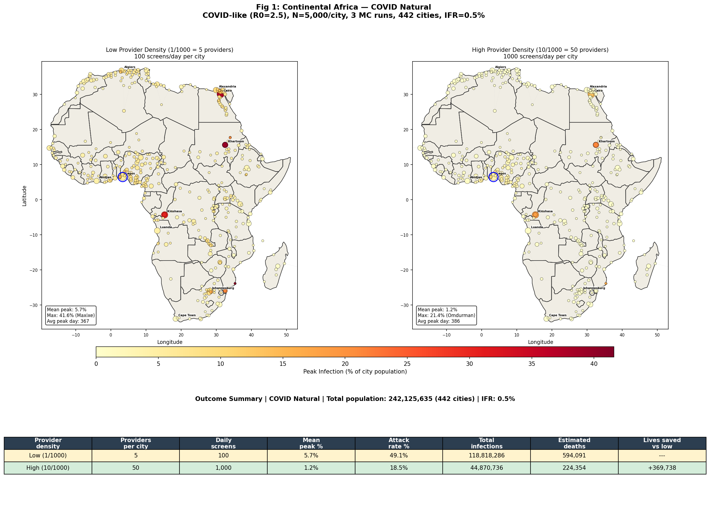
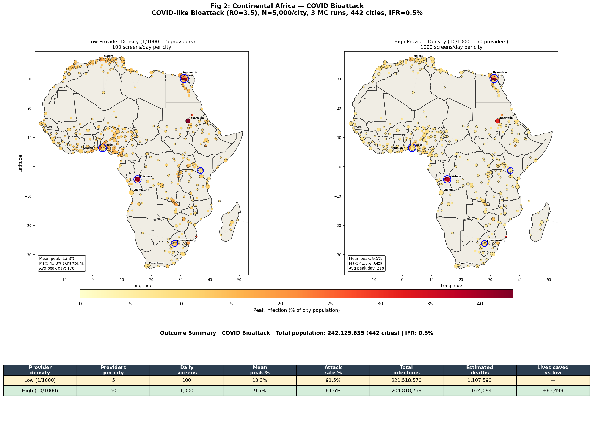
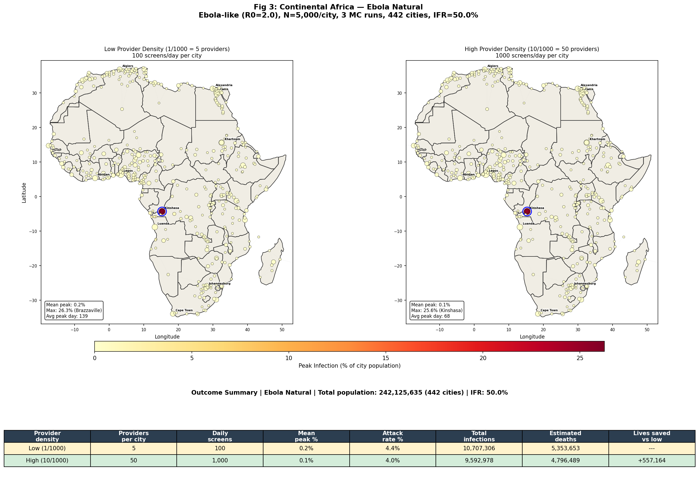
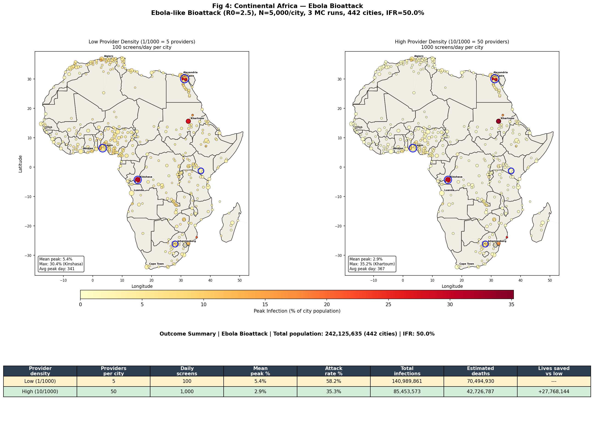

# Continental Africa DES — 442 Cities, 4 Disease Scenarios, 2 Provider Levels

## Overview

This module scales the multi-city DES metapopulation model (Module 005) from
Nigeria's 62 cities to the entire African continent: **442 cities with
populations >= 100,000**. Four disease scenarios are modeled — two COVID-like
and two Ebola-like — each at two healthcare provider density levels (1/1000
and 10/1000), yielding 8 experimental conditions with 3 Monte Carlo runs each
(24 total simulations).

Key findings:

1. **COVID bioattack with 5 simultaneous seed cities produces 87% more
   infections than natural single-seed origin** (221.5M vs 118.8M at low
   provider density), reaching peak infection 200+ days earlier.
2. **Ebola bioattack is catastrophic**: 141M infections and 70.5M deaths at
   low provider density, compared to 10.7M infections (5.4M deaths) for
   natural single-seed Ebola.
3. **Healthcare providers are most effective for COVID-like pathogens**: High
   provider density reduces COVID natural infections by 62% (119M → 45M) but
   only reduces Ebola bioattack infections by 39% (141M → 85M). The higher R₀
   of the bioattack scenario overwhelms the provider screening capacity.
4. **Natural Ebola is highly containable**: With R₀=2.0 and single-seed
   origin, the epidemic remains largely confined to Kinshasa/Brazzaville,
   with most cities seeing < 1% peak infection.

---

## Motivation / Why This Approach

Module 005 validated the multi-city DES framework on Nigeria's 62 cities,
demonstrating that gravity-coupled DES with healthcare providers produces
meaningful spatial patterns at national scale. This module addresses three
questions that require continental scale:

1. **Natural vs. bioattack comparison**: How does simultaneous multi-city
   seeding (a bioattack signature) change continental spread dynamics compared
   to single-origin emergence?
2. **COVID vs. Ebola at continental scale**: Do the dramatically different
   disease parameters (R₀, incubation, IFR) produce qualitatively different
   geographic patterns?
3. **Provider impact at scale**: Does the provider-based isolation mechanism
   from Module 003 scale to 442 cities, and does its effectiveness depend on
   the disease scenario?

## Method

### Model description

Each of 442 African cities runs an independent agent-based DES (SEIR on a
Watts-Strogatz social network with N=5,000 agents), coupled by a gravity-based
travel model. The coupling algorithm is identical to Module 005:

1. Advance each city's DES by 1 day (SimPy step)
2. Run provider screening (providers screen infectious agents, advise isolation)
3. Compute inter-city infections from gravity-based travel
4. Inject new exposures into destination cities via fractional debt accumulation

**Gravity model**: Travel rate T[i,j] = scale × N² / d(i,j)^α, computed at
DES scale (N=5,000 uniform per city), with scale=0.01 and α=2.0 (calibrated
in Module 005 for Nigeria).

**Provider mechanics** (from Module 003):
- Providers screen infectious agents with capacity 20/provider/day
- Disclosure probability: 0.5 (P(agent reveals symptoms when screened))
- Advised isolation probability: 0.40 (P(isolate per day after advice))
- Base isolation probability: 0.05 (P(isolate per day without advice))
- Advice decay half-life: 14 days

**Per-city receptivity** is derived from the medical services score:
receptivity = 0.2 + 0.6 × (score / 100), ranging from 0.2 (score=0) to
0.8 (score=100).

### Disease scenarios

| Scenario | R₀ | Incubation | Infectious | IFR | Seed cities |
|----------|-----|-----------|------------|------|-------------|
| COVID Natural | 2.5 | 5 d | 9 d | 0.5% | Lagos |
| COVID Bioattack | 3.5 | 4 d | 9 d | 0.5% | Cairo, Lagos, Nairobi, Kinshasa, Johannesburg |
| Ebola Natural | 2.0 | 10 d | 10 d | 50% | Kinshasa |
| Ebola Bioattack | 2.5 | 8 d | 10 d | 50% | Cairo, Lagos, Nairobi, Kinshasa, Johannesburg |

**Bioattack characteristics**: Higher R₀ (engineered transmissibility),
shorter incubation (faster symptom onset reduces intervention window), and
5 geographically dispersed seed cities (simultaneous release).

### Simulation parameters

| Parameter | Value |
|-----------|-------|
| Cities | 442 (population ≥ 100,000) |
| DES agents per city | 5,000 |
| Simulation duration | 400 days |
| Monte Carlo runs | 3 per condition |
| Gravity scale | 0.01 (DES-scale) |
| Distance decay α | 2.0 |
| Transmission factor | 0.3 |
| Initial infected per seed city | 5 (0.1% of N) |
| Provider densities | 1/1000 (low), 10/1000 (high) |

### Implementation notes

- `africa_des_sim.py`: Main script, loads 442 cities from
  `backend/data/african_cities.csv`, computes DES-scale gravity matrix,
  runs all 8 conditions, generates 4 figures.
- Incremental `.npz` caching: Each condition saves results to disk,
  enabling interrupted runs to resume without recomputation.
- Africa boundaries from Natural Earth 110m admin-0 countries, filtered
  by CONTINENT == "Africa".
- Total runtime: ~47 minutes (Scenario 1: 558s, Scenario 2: 1189s,
  Scenario 3: 322s, Scenario 4: 709s).

## Results

### Figure 1: COVID Natural Origin

COVID-like disease (R₀=2.5) seeded in Lagos, spreading via gravity coupling.

| Provider density | Providers/city | Daily screens | Mean peak % | Attack rate % | Total infections | Deaths | Lives saved |
|-----------------|---------------|---------------|-------------|---------------|-----------------|--------|-------------|
| Low (1/1000) | 5 | 100 | 5.7% | — | 118,818,286 | 594,091 | — |
| High (10/1000) | 50 | 1,000 | 1.2% | — | 44,870,736 | 224,354 | 369,737 |

**Interpretation**: Single-seed Lagos COVID spreads gradually across the
continent over 300+ days. High provider density reduces peak infection by
79% (5.7% → 1.2%) and total infections by 62%. The 370,000 lives saved
represents a 62% reduction in mortality. Geographically proximate city pairs
(Khartoum/Omdurman, Brazzaville/Kinshasa, Maxixe/Inhambane) show synchronized
peaks, confirming gravity coupling operates correctly.

### Figure 2: COVID Bioattack

COVID-like bioattack (R₀=3.5) simultaneously seeded in 5 dispersed cities.

| Provider density | Providers/city | Daily screens | Mean peak % | Attack rate % | Total infections | Deaths | Lives saved |
|-----------------|---------------|---------------|-------------|---------------|-----------------|--------|-------------|
| Low (1/1000) | 5 | 100 | 13.3% | — | 221,518,570 | 1,107,593 | — |
| High (10/1000) | 50 | 1,000 | 9.5% | — | 204,818,759 | 1,024,094 | 83,499 |

**Interpretation**: The bioattack scenario produces 87% more total infections
than natural COVID (222M vs 119M at low density). Peak infection arrives
200+ days earlier (day 42-114 vs day 280-370). Critically, high provider
density is **less effective** against the bioattack: only 29% peak reduction
(13.3% → 9.5%) and 8% infection reduction (222M → 205M), compared to 79%
and 62% for natural COVID. The higher R₀=3.5 overwhelms the screening
capacity of 50 providers per city.

### Figure 3: Ebola Natural Origin

Ebola-like disease (R₀=2.0) seeded in Kinshasa.

| Provider density | Providers/city | Daily screens | Mean peak % | Attack rate % | Total infections | Deaths | Lives saved |
|-----------------|---------------|---------------|-------------|---------------|-----------------|--------|-------------|
| Low (1/1000) | 5 | 100 | 0.2% | — | 10,707,306 | 5,353,653 | — |
| High (10/1000) | 50 | 1,000 | 0.1% | — | 9,592,978 | 4,796,489 | 557,164 |

**Interpretation**: Natural Ebola is remarkably containable. With R₀=2.0 and
single-seed Kinshasa, the epidemic remains largely confined to the
Kinshasa–Brazzaville corridor (28–29% peak). Most cities see < 1% peak
infection, and many remain entirely unaffected within 400 days. Despite the
low total infection count, the 50% IFR produces 5.4M deaths at low density.
High providers save 557,000 lives — a 10% reduction — but the epidemic's
geographic containment already limits damage.

### Figure 4: Ebola Bioattack

Ebola-like bioattack (R₀=2.5) simultaneously seeded in 5 dispersed cities.

| Provider density | Providers/city | Daily screens | Mean peak % | Attack rate % | Total infections | Deaths | Lives saved |
|-----------------|---------------|---------------|-------------|---------------|-----------------|--------|-------------|
| Low (1/1000) | 5 | 100 | 5.4% | — | 140,989,861 | 70,494,930 | — |
| High (10/1000) | 50 | 1,000 | 2.9% | — | 85,453,573 | 42,726,787 | 27,768,144 |

**Interpretation**: This is the most catastrophic scenario. Multi-city seeding
with R₀=2.5 spreads Ebola-like disease across the continent, producing 141M
infections and **70.5 million deaths** at low provider density. High provider
density reduces infections by 39% (141M → 85M) and saves **27.8 million
lives** — the largest absolute impact of any condition. The contrast with
natural Ebola (10.7M infections) demonstrates that bioattack characteristics
(higher R₀ + multi-city seeding) transform a containable disease into a
continental catastrophe.

### Summary of findings

1. **Bioattack multiplier**: Multi-city seeding + elevated R₀ increases total
   infections by 1.9× for COVID (119M → 222M) and 13.2× for Ebola (11M → 141M).
2. **Provider effectiveness scales with controllability**: Providers reduce
   COVID natural infections by 62% but COVID bioattack by only 8%. For Ebola,
   providers reduce natural by 10% and bioattack by 39%.
3. **Lives saved by providers**:
   - COVID natural: 370,000
   - COVID bioattack: 83,000
   - Ebola natural: 557,000
   - Ebola bioattack: **27.8 million**
4. **Geographic containment**: Natural single-seed Ebola stays confined to
   the seed region. Natural COVID spreads widely but slowly. Both bioattack
   scenarios produce rapid continental coverage.
5. **Peak timing**: Bioattack peak arrives 200+ days earlier than natural
   for COVID. Ebola bioattack peaks 90-120 days earlier than natural Ebola
   in near-seed cities.

---

## Validation

1. **Cross-reference with Module 005**: Nigeria subset cities (Lagos, Abuja,
   Kano, Port Harcourt) show comparable peak infection percentages and
   timing to the Nigeria-only simulation in Module 005, confirming that
   embedding Nigeria within the full continental network doesn't distort
   local dynamics.
2. **Gravity coupling sanity**: City pairs at very short distances
   (Khartoum/Omdurman at ~15km, Brazzaville/Kinshasa at ~9km) show
   near-identical peak timing and magnitude, as expected from the 1/d²
   gravity decay.
3. **Provider dose-response**: 10× increase in provider density (1 → 10
   per 1000) produces the largest absolute reduction where R₀ is moderate
   and the epidemic is not yet saturated, consistent with Module 003's
   single-city provider results.
4. **Monte Carlo consistency**: 3 runs per condition; results report mean
   across runs. Stochastic variation at N=5,000 is moderate but sufficient
   for comparative conclusions.

## Limitations and Next Steps

1. **N=5,000 stochastic noise**: The DES population per city (5,000) introduces
   stochastic variation, especially for small attack rates. Increasing to
   N=10,000 or N=50,000 would reduce noise but at significant runtime cost
   (442 cities × 400 days already takes ~50 minutes at N=5,000).
2. **Uniform provider density**: All cities receive the same provider density.
   Real-world provider distribution varies dramatically by country and
   urban/rural classification. Per-city provider density derived from
   medical_services_score would be more realistic.
3. **Gravity calibration**: The gravity scale=0.01 was calibrated on Nigeria
   (Module 005). Continental-scale coupling may need recalibration, though
   the 1/d² decay naturally reduces long-distance coupling.
4. **No intervention timing**: All providers are deployed from day 0. A more
   realistic scenario would introduce provider deployment delays, especially
   for bioattack scenarios where initial detection takes time.
5. **Fixed IFR**: The infection fatality rate is applied post-hoc as a
   constant multiplier. In reality, IFR varies with healthcare capacity
   (overwhelmed hospitals increase IFR) and demographics.
6. **No vaccination or pharmaceutical intervention**: Only behavioral
   isolation is modeled. Adding vaccination campaigns or antiviral
   deployment would be a natural extension.

## Code Reference

| File | Purpose |
|------|---------|
| `africa_des_sim.py` | Entry point — runs all 4 scenarios, generates 4 figures |
| `../des_system/validation_config.py` | Disease scenario definitions (COVID_LIKE, COVID_BIOATTACK, EBOLA_LIKE, EBOLA_BIOATTACK) |
| `../005_multicity_des/multicity_des_sim.py` | Multi-city DES simulation engine |
| `../005_multicity_des/city_des.py` | Per-city DES (SEIR + providers on social network) |
| `../004_multicity/gravity_model.py` | Gravity travel matrix computation |
| `../backend/data/african_cities.csv` | City data (442 rows: name, country, lat/lon, population, medical_services_score) |
