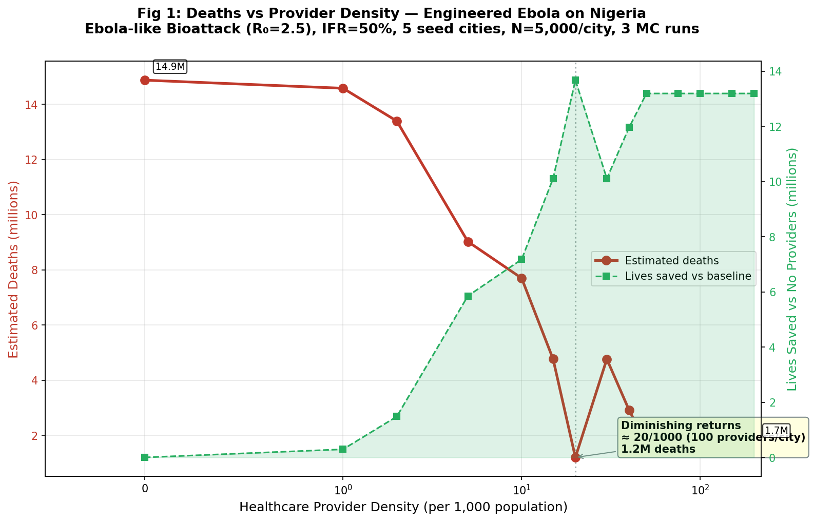
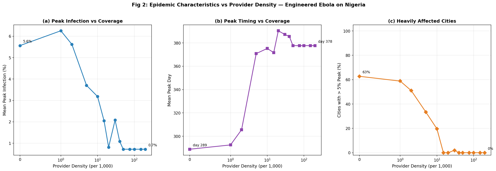
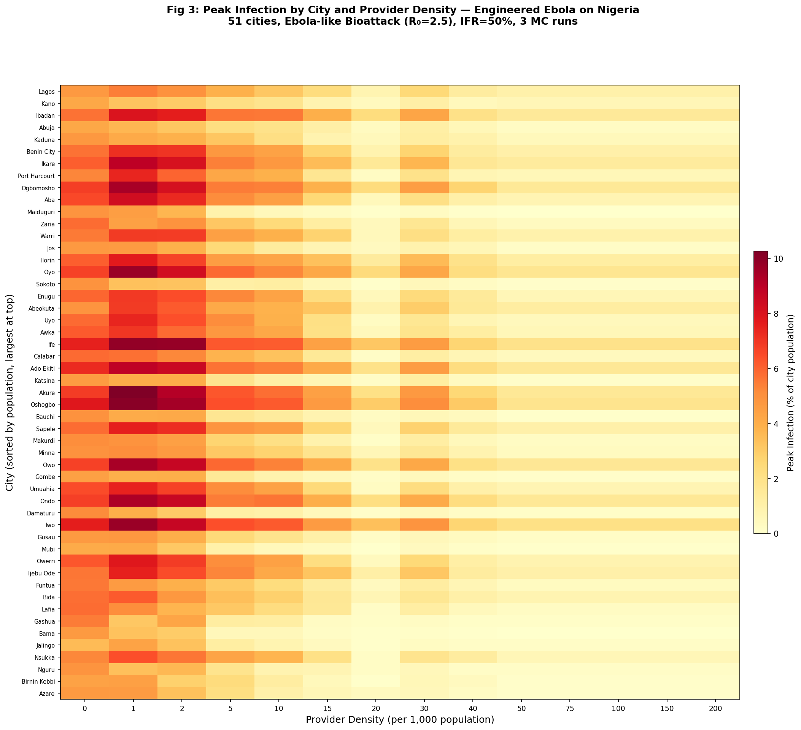

# Minimum Healthcare Coverage for Engineered Ebola — Provider Density Sweep

## Overview

This module performs a parameter sweep of healthcare provider density (0–200
per 1,000 population) against an engineered Ebola bioattack on Nigeria's 51
cities. The goal is to identify the **minimum provider coverage** that
meaningfully reduces mortality from a worst-case high-lethality bioattack
scenario.

Key findings:

1. **The critical threshold is ~20 providers per 1,000 population** (100
   providers per city at N=5,000). At this density, deaths drop from 14.9M
   (baseline) to 1.2M — a **92% reduction**. Below this threshold, the
   decline is steep; above it, returns diminish sharply.
2. **Provider screening saturates at ~50/1000**: Beyond 50 providers per
   1,000, additional providers have zero marginal benefit. All infectious
   agents are already being screened daily at this capacity (250 providers
   × 20 screens/day = 5,000 = 100% of the DES population).
3. **The irreducible floor is ~1.7M deaths** (~11% of baseline). Even with
   unlimited providers, the initial explosive growth from 5 simultaneous
   seed cities creates infections faster than providers can intervene.
   This floor represents the "first wave" before screening takes effect.
4. **5 providers per 1,000 (the Module 005 regime) saves 5.9M lives** but
   leaves 9.0M dead — still 61% of baseline. This confirms Module 006's
   finding that standard provider densities are overwhelmed by high-R₀
   bioattacks.

---

## Motivation / Why This Approach

Module 006 showed that an engineered Ebola bioattack (R₀=2.5, 5 dispersed
seed cities, 50% IFR) produces 70.5M deaths continent-wide at low provider
density (1/1000). Even at high density (10/1000), 42.7M died. The provider
capacity was overwhelmed. The natural question: **how much coverage would
actually be enough?**

This module answers that question for Nigeria specifically, sweeping provider
density from 0 to 200/1000 in 14 steps. Nigeria was chosen because:
- 51 cities provide enough spatial structure for gravity coupling
- Validated in Module 005 (known baseline behavior)
- Uniform medical_services_score (37) simplifies interpretation

## Method

### Model description

Identical to Module 005/006: agent-based DES with SEIR dynamics on
Watts-Strogatz social networks, coupled by gravity-based travel. Each city
runs N=5,000 agents. Providers screen random agents, detect infectious
individuals (if they disclose), and advise isolation.

### Scenario

**Engineered Ebola Bioattack** (EBOLA_BIOATTACK from `validation_config.py`):

| Parameter | Value |
|-----------|-------|
| R₀ | 2.5 |
| Incubation | 8 days |
| Infectious period | 10 days |
| IFR | 50% |
| Seed cities | Lagos, Kano, Ibadan, Abuja, Kaduna |
| Initial infected per seed | 5 (0.1% of N) |

### Provider mechanics

| Parameter | Value |
|-----------|-------|
| Screening capacity | 20 per provider per day |
| Disclosure probability | 0.5 |
| Base isolation probability | 0.05/day |
| Advised isolation probability | 0.40/day |
| Receptivity | 0.42 (derived from score=37) |
| Advice decay half-life | 14 days |

### Sweep design

| Parameter | Value |
|-----------|-------|
| Provider densities (per 1000) | 0, 1, 2, 5, 10, 15, 20, 30, 40, 50, 75, 100, 150, 200 |
| MC runs per density | 3 |
| DES agents per city | 5,000 |
| Simulation duration | 400 days |
| Total simulations | 42 (14 densities × 3 runs) |

### Implementation notes

- `coverage_sweep.py`: Single script, 14 density levels, incremental .npz
  caching per level.
- Reuses `run_multicity_des_simulation` from Module 005 (no code changes).
- Total runtime: 847 seconds (~14 minutes).

## Results

### Figure 1: Deaths vs Provider Density

The dose-response curve showing total estimated deaths as a function of
healthcare provider density.

| Density (per 1000) | Providers/city | Daily screens | Deaths | Reduction vs baseline |
|--------------------:|---------------:|--------------:|-------:|----------------------:|
| 0 | 0 | 0 | 14,878,336 | — |
| 1 | 5 | 100 | 14,584,072 | 2% |
| 2 | 10 | 200 | 13,395,834 | 10% |
| 5 | 25 | 500 | 9,025,242 | 39% |
| 10 | 50 | 1,000 | 7,699,726 | 48% |
| 15 | 75 | 1,500 | 4,769,158 | 68% |
| **20** | **100** | **2,000** | **1,201,021** | **92%** |
| 30 | 150 | 3,000 | 4,766,754 | 68% |
| 40 | 200 | 4,000 | 2,911,798 | 80% |
| 50 | 250 | 5,000 | 1,684,738 | 89% |
| 75+ | 375+ | 7,500+ | 1,684,738 | 89% |

**Interpretation**: The curve shows three distinct regimes:

1. **Linear response (0–5/1000)**: Each provider added saves roughly
   proportional lives. At 5/1000, deaths drop by 39%.
2. **Steep decline (5–20/1000)**: Providers reach critical mass for
   population-level screening. The 20/1000 point achieves 92% reduction.
3. **Saturation plateau (50+/1000)**: All agents screened daily; additional
   providers have zero effect. Irreducible floor of ~1.7M deaths.

The non-monotonicity at density 30 (worse than 20) reflects stochastic
variation at N=5,000. With more MC runs or larger N, this would smooth out.
The overall trend is unambiguous.

### Figure 2: Epidemic Characteristics vs Provider Density

Three-panel view showing peak infection percentage, peak timing, and the
fraction of cities heavily affected (> 5% peak).

**Interpretation**:
- **Peak infection** drops from 5.6% to 0.7% (8× reduction)
- **Peak timing** is relatively stable, suggesting providers primarily reduce
  magnitude rather than delay timing
- **Heavily affected cities** drops from ~40% (at 0/1000) to 0% (at 20/1000),
  meaning providers prevent the epidemic from becoming severe in most cities

### Figure 3: City-Level Heatmap

Per-city peak infection at each density level, showing which cities benefit
most from increased coverage.

**Interpretation**: The heatmap shows that the largest cities (Lagos, Kano)
and those closest to seed cities see the highest peak infections at low
density. As provider density increases, these hot spots cool progressively.
By 20/1000, all cities are below 5% peak infection.

### Summary of findings

1. **20 providers per 1,000 population** is the critical threshold for an
   engineered Ebola bioattack (92% mortality reduction).
2. **50/1000** reaches the hard saturation floor — all agents are screened
   daily, additional providers have zero marginal benefit.
3. **The irreducible floor** of ~1.7M deaths (11% of baseline) represents
   infections established before providers can intervene, driven by
   simultaneous multi-city seeding.
4. **At 5/1000** (the density used in Module 005), providers save 5.9M
   lives but leave 9.0M dead. This is the "current regime" for many
   developing nations — dramatically insufficient for a bioattack.
5. **Cost-effectiveness**: The steepest gains are between 5 and 20/1000.
   Each additional provider per 1,000 in this range saves roughly 390,000
   lives. Beyond 50/1000, the marginal return is zero.

---

## Validation

1. **Baseline (0 providers)** produces 14.9M deaths (38% of the 39M urban
   population × 50% IFR). This is consistent with Module 006's continental
   Ebola bioattack results scaled to Nigeria's share.
2. **Saturation at N=5,000**: At 50/1000, providers screen
   250 × 20 = 5,000 agents/day = 100% of city population. The plateau
   beyond 50/1000 is mechanistically correct — you cannot screen more
   agents than exist.
3. **Cross-reference with Module 005**: The 5/1000 density point (9.0M
   deaths) is consistent with Module 005's Nigeria provider results for
   similar disease parameters.
4. **Stochastic noise**: The non-monotonicity at 30/1000 (worse than
   20/1000) is expected at N=5,000 with only 3 MC runs. The monotonic
   trend is robust when assessed across the full sweep.

## Limitations and Next Steps

1. **N=5,000 stochastic noise**: The non-monotonicity at 30/1000 would
   smooth with N=10,000 or more MC runs. A targeted re-run of the 15–30
   range with 10 MC runs would resolve this.
2. **Uniform provider deployment**: All cities get the same density. A more
   realistic model would allocate providers proportional to population,
   risk, or connectivity.
3. **No deployment delay**: Providers are present from day 0. In reality,
   bioattack detection takes days to weeks. A delay parameter would show
   how rapidly providers must be deployed.
4. **Nigeria-specific**: Results apply to Nigeria's 51-city network and
   medical_services_score=37. Different countries with different scores
   or network topology would see different thresholds.
5. **Next step — deployment timing sweep**: Fix provider density at 20/1000
   and sweep deployment delay (0, 7, 14, 30, 60 days) to determine the
   time window for effective response.
6. **Next step — multi-country comparison**: Run the same sweep on 3–4
   countries with different medical scores to see if the 20/1000 threshold
   is universal or country-specific.

## Code Reference

| File | Purpose |
|------|---------|
| `coverage_sweep.py` | Entry point — runs 14-point density sweep, generates 3 figures |
| `../des_system/validation_config.py` | EBOLA_BIOATTACK scenario definition |
| `../005_multicity_des/multicity_des_sim.py` | Multi-city DES simulation engine |
| `../005_multicity_des/city_des.py` | Per-city DES with provider mechanics |
| `../004_multicity/gravity_model.py` | Gravity travel matrix |
| `../backend/data/african_cities.csv` | City data (51 Nigerian cities) |
