# Person Journey Through the Pandemic Simulation

```mermaid
flowchart TD
    S["<b>SUSCEPTIBLE</b><br/>Healthy, can be infected"]

    %% Contact & Transmission
    CONTACT{"Daily Contact<br/>with Infectious Person?"}
    TRANSMIT{"Transmission<br/>p = 0.15 per contact"}

    S --> CONTACT
    CONTACT -- "No" --> S
    CONTACT -- "Yes" --> TRANSMIT
    TRANSMIT -- "No infection<br/>(85%)" --> S

    %% Exposed
    E["<b>EXPOSED</b><br/>Infected, not yet infectious<br/><i>~3 days (CV 0.2, min 1d)</i>"]
    TRANSMIT -- "Infected (15%)" --> E

    %% Infectious
    I["<b>INFECTIOUS</b><br/>Pre-symptomatic, contagious<br/><i>~2 days (CV 0.2, min 0.5d)</i>"]
    E --> I

    %% Daily isolation decision during contagious period
    ISO_CHECK{"Daily Isolation<br/>Decision"}
    I --> ISO_CHECK
    ISO_CHECK -- "Isolates<br/>(0% base / 40% if advised)" --> NO_SPREAD["No contacts today<br/><i>still progresses through disease</i>"]
    ISO_CHECK -- "Does not isolate" --> SPREAD["Contacts ~50% of network<br/>+ 15% random strangers<br/><i>each contact: p=0.15 transmission</i>"]
    NO_SPREAD -.-> SYM
    SPREAD -.-> SYM

    %% Symptomatic
    SYM["<b>SYMPTOMATIC</b><br/>Showing symptoms, still contagious<br/><i>~7 days (CV 0.3, min 2d)</i>"]

    %% Provider screening can happen during I or SYM
    PROVIDER{"Provider<br/>Screening?"}
    SYM --> PROVIDER
    PROVIDER -- "Screened & discloses<br/>(p=0.5)" --> ADVISED["<b>ADVISED</b><br/>Isolation prob jumps to 40%<br/>Care-seeking prob jumps to 50%"]
    PROVIDER -- "Not screened /<br/>does not disclose" --> OUTCOME
    ADVISED --> OUTCOME

    %% Outcome determination
    OUTCOME{"Hospitalization?<br/><b>Age &lt; 60:</b> 15%<br/><b>Age &ge; 60:</b> 30%"}

    %% Direct recovery
    OUTCOME -- "No (70-85%)" --> R["<b>RECOVERED</b><br/>Immune"]

    %% Hospitalization
    H["<b>HOSPITALIZED</b><br/>Consumes healthcare workers,<br/>PPE, reagents<br/><i>~7 days (CV 0.29, min 3d)</i>"]
    OUTCOME -- "Yes (15-30%)" --> H

    %% Hospital outcome
    MORT{"Mortality?<br/><b>Age &lt; 60:</b> 2%<br/><b>Age &ge; 60:</b> 4%"}
    H --> MORT
    MORT -- "Survives (96-98%)" --> R
    MORT -- "Dies (2-4%)" --> D["<b>DECEASED</b>"]

    %% Styling
    style S fill:#e0f2fe,stroke:#0284c7,color:#0c4a6e
    style E fill:#fef3c7,stroke:#d97706,color:#78350f
    style I fill:#fed7aa,stroke:#ea580c,color:#7c2d12
    style SYM fill:#fecaca,stroke:#dc2626,color:#7f1d1d
    style H fill:#e9d5ff,stroke:#7c3aed,color:#4c1d95
    style R fill:#d1fae5,stroke:#059669,color:#064e3b
    style D fill:#f1f5f9,stroke:#64748b,color:#334155
    style ADVISED fill:#fef9c3,stroke:#ca8a04,color:#713f12
    style NO_SPREAD fill:#f0fdf4,stroke:#86efac,color:#166534
    style SPREAD fill:#fff1f2,stroke:#fca5a5,color:#991b1b
```



## Key Parameters

| Parameter | Value | Notes |
|---|---|---|
| **Transmission prob** | 0.15 per contact | Per interaction with infectious person |
| **Daily contact rate** | 50% of network | Fraction of contacts seen per day |
| **Random mixing** | 15% | Fraction of contacts outside network |
| **Exposure period** | ~3 days | Gaussian, CV=0.2, min 1 day |
| **Infectious period** | ~2 days | Pre-symptomatic, Gaussian, CV=0.2, min 0.5 days |
| **Symptomatic period** | ~7 days | Gaussian, CV=0.3, min 2 days |
| **Hospital stay** | ~7 days | Gaussian, CV=0.29, min 3 days |
| **Hospitalization rate** | 15% / 30% | Age < 60 / Age >= 60 |
| **Mortality rate** | 2% / 4% | Of hospitalized, age < 60 / >= 60 |
| **Base isolation prob** | 0% | Without provider advice |
| **Advised isolation prob** | 40% | After provider screening + advice |
| **Provider disclosure** | 50% | Prob person discloses symptoms when screened |
| **Advice receptivity** | 60% | Prob person accepts provider advice |

## State Durations (all Gaussian-sampled)

```
S ──[contact]──> E ──[~3d]──> I ──[~2d]──> SYMPTOMATIC ──[~7d]──> Outcome
                                                                      │
                                                          ┌───────────┴───────────┐
                                                          ▼                       ▼
                                                      RECOVERED            HOSPITALIZED
                                                                           ──[~7d]──>
                                                                      ┌───────┴───────┐
                                                                      ▼               ▼
                                                                  RECOVERED       DECEASED
```

Total disease course (no hospitalization): **~12 days** (3 + 2 + 7)
Total disease course (with hospitalization): **~19 days** (3 + 2 + 7 + 7)
