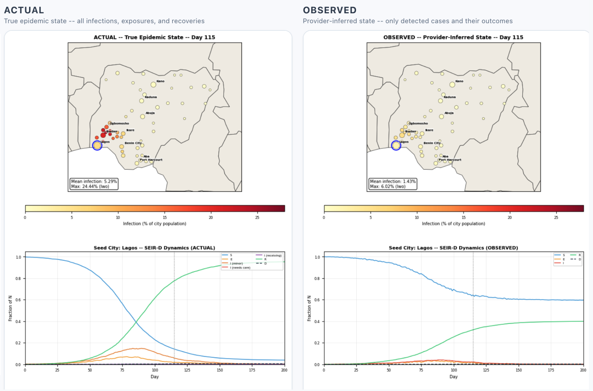

# APR: AI-Augmented Pandemic Response



A continental-scale pandemic simulation platform that models the impact of AI-powered health agents on epidemic outcomes across sub-Saharan Africa. The system simulates AI agents that conduct symptom screening, isolation counseling, contact tracing, and medical countermeasure coordination via voice and text interactions with community members.

Built on a discrete-event simulation (DES) engine validated against classical SEIR ordinary differential equations, the platform models disease propagation across realistic social networks in 442 African cities (54 countries, 1.4 billion population) with gravity-model inter-city coupling, supply chain constraints, and the Frieden 7-1-7 outbreak response framework.

## Quick Start

### Prerequisites

- Python 3.11+ with pip
- Node.js 18+ with npm

### Backend

```bash
cd simulation_app/backend
pip install -r requirements.txt
uvicorn main:app --reload --port 8000
```

### Frontend

```bash
cd frontend
npm install
npm run dev
```

Open **http://localhost:3000** to access the dashboard.

## What This Models

The simulation evaluates AI health agents as a **medical countermeasure** with quantifiable dose-response characteristics. Each AI agent interaction can produce:

1. **Surveillance** -- symptom screening, case detection, contact identification
2. **Behavioral intervention** -- isolation counseling, health guidance, care referrals
3. **Coordination** -- vaccination scheduling, supply chain signaling, resource routing

The platform generates a **dual-view** of every epidemic: the actual ground-truth state and the observed state as seen through AI provider surveillance. This dual-view architecture is central to modeling the gap between what is happening and what the health system knows.

## Dashboard

| Tab | Description |
|-----|-------------|
| **Simulation** | Run continental-scale DES simulations with configurable parameters |
| **Data** | Explore African city data, healthcare infrastructure, and demographics |
| **Supply Chain** | Visualize the three-tier medical supply chain model |
| **Interventions** | Configure AI-powered behavioral interventions |
| **Audio** | "Voices of Africa" -- AI-generated greetings in 25+ languages across 55 countries |

## Project Structure

```
pandemic_modeling/
├── simulation_app/
│   └── backend/                   # FastAPI server (port 8000)
│       ├── main.py                # API endpoints and session management
│       ├── simulation.py          # Multi-city simulation orchestrator
│       ├── city_des_extended.py   # Core 7-state DES engine
│       ├── supply_chain.py        # Three-tier supply chain model
│       ├── allocation_strategy.py # Pluggable resource allocation (rule-based, AI-optimized)
│       ├── renderer.py            # Map frame and video rendering
│       ├── event_log.py           # Structured simulation event logging
│       ├── sim_config.py          # Disease params and city data loaders
│       ├── supply_config.py       # Health facility and resource initialization
│       ├── schemas.py             # Pydantic request/response models
│       ├── progress.py            # SSE progress streaming
│       ├── cli.py                 # Command-line simulation runner
│       ├── calibrate.py           # Parameter calibration utilities
│       ├── tests/                 # Conservation law and supply chain tests
│       └── data/                  # Disease params, city data, health facilities
│
├── frontend/                      # React + Vite dashboard (port 3000)
│   ├── src/
│   │   ├── App.jsx                # Main dashboard with tab navigation
│   │   └── components/            # SimulationTab, DataTab, AudioExplorationTab, etc.
│   └── public/
│       ├── audio/                 # Pre-generated TTS audio files (55 countries)
│       └── data/                  # GeoJSON boundaries, city data
│
├── des_system/                    # Shared DES primitives
│   ├── disease_model.py           # SEIR ODE reference implementation
│   ├── social_network.py          # Watts-Strogatz network generator
│   └── config.py                  # EpidemicScenario definitions
│
├── 001_validation/                # DES-SEIR convergence validation
├── 002_agent_based_des/           # Behavioral isolation mechanics
├── 003_absdes_providers/          # Healthcare provider screening
├── 004_multicity/                 # Multi-city gravity coupling
├── 005_multicity_des/             # Nigeria 51-city country-scale
├── 006_continental_africa/        # Continental 442-city simulation
├── 007_coverage_sweep/            # Provider dose-response curves
├── 008_supply_chain_constrained/  # Infrastructure and supply constraints
├── 009_717assessment/             # 7-1-7 outbreak response evaluation
│
├── absdes_explorer/               # Interactive ABS-DES model explorer
├── PERSON_JOURNEY.md              # Disease state transition diagram
├── DATASETS.md                    # Data sources, licensing, and attribution
└── README.md
```

## Simulation Engine

The core engine (`city_des_extended.py`) uses agent-based discrete-event simulation with:

- **7-state disease model**: S &rarr; E &rarr; I_mild &rarr; I_severe &rarr; I_critical &rarr; R / D
- **Small-world social networks**: Watts-Strogatz topology (mean degree 12, rewiring 0.3)
- **Gravity-model coupling**: Inter-city travel proportional to population product over distance squared
- **AI provider screening**: 70/30 targeted screening (contact-traced + random)
- **Behavioral mechanics**: Isolation compliance, care-seeking, advice receptivity
- **Supply chain**: Finite diagnostics, vaccines (manufactured from day 120), antivirals, PPE

See `PERSON_JOURNEY.md` for the full state transition diagram.

## Validation

The simulation was validated through 9 progressive modules, each building on the previous:

| Module | Validation | Key Result |
|--------|-----------|------------|
| 001 | DES-SEIR convergence | DES reproduces ODE dynamics as N &rarr; &infin; |
| 002 | Behavioral isolation | Monotonic curve flattening with increasing isolation |
| 003 | Provider detection | Dual-view surveillance tracks ground truth at 50/1000 density |
| 004 | Multi-city gravity | Wave propagation timing correlates with geographic distance |
| 005 | Country-scale (Nigeria) | 51-city simulation with provider impact |
| 006 | Continental-scale | 442 cities, 4 disease scenarios, 54 countries |
| 007 | Coverage sweep | Dose-response: 10-30/1000 minimum effective deployment |
| 008 | Supply chain | Behavioral diagnosis maintains 98.5% coverage under supply depletion |
| 009 | 7-1-7 assessment | AI providers achieve 100% detection compliance vs 0% baseline |

Each module has a self-contained validation script that generates figures into a `results/` directory. Run any script directly to reproduce (e.g., `python 001_validation/validation_des_seir.py`).

## API

**Configuration:**

| Endpoint | Method | Description |
|----------|--------|-------------|
| `/countries` | GET | List countries with city counts |
| `/scenarios` | GET | Disease scenarios with parameters |
| `/disease-params` | GET | Full disease parameter table |
| `/resources/defaults` | GET | Default resource configuration |

**Simulation lifecycle:**

| Endpoint | Method | Description |
|----------|--------|-------------|
| `/simulate/absdes` | POST | Start a simulation (returns session_id) |
| `/simulate/absdes/{id}/progress` | GET | SSE stream of simulation progress |
| `/simulate/absdes/{id}/summary` | GET | Final simulation metrics |
| `/simulate/absdes/{id}/metadata` | GET | Simulation parameters and configuration |
| `/simulate/absdes/sessions` | GET | List all completed sessions |
| `/simulate/absdes/latest` | GET | Most recent session ID and params |
| `/simulate/absdes/{id}` | DELETE | Delete a session and its data |

**Visualization and export:**

| Endpoint | Method | Description |
|----------|--------|-------------|
| `/simulate/absdes/{id}/frame/{view}/{day}` | GET | Rendered PNG frame |
| `/simulate/absdes/{id}/resources` | GET | Resource utilization time series |
| `/simulate/absdes/{id}/events` | GET | Structured simulation event log |
| `/simulate/absdes/{id}/export/csv` | GET | Export results as CSV |
| `/simulate/absdes/{id}/export/video` | GET | Export animation as MP4/WebM |
| `/api/absdes/{id}/schema` | GET | Full parameter schema with current values |
| `/api/absdes/{id}/aggregates/{level}` | GET | Aggregated metrics (continent/country/city) |
| `/api/absdes/{id}/timeseries/{level}` | GET | Time series data at specified level |

## Tech Stack

**Backend:** Python 3.11, FastAPI, SimPy, NumPy, SciPy, Matplotlib, Seaborn

**Frontend:** React 18, Vite, Tailwind CSS, Recharts, Leaflet, Lucide Icons

**Audio:** ElevenLabs TTS (eleven_multilingual_v2, eleven_v3)

## Data Sources and Attribution

See `DATASETS.md` for full details and licensing.

- **Natural Earth** -- public domain. City locations and country boundaries.
- **Healthsites.io** -- ODbL v1.0 (OpenStreetMap derivative). Health facility locations for 49 African countries.
- **UN World Urbanization Prospects** -- city population data.
- **World Bank** -- telecommunications infrastructure indicators.

Health facility data: &copy; OpenStreetMap contributors, ODbL 1.0. Provided by [healthsites.io](https://healthsites.io) via HDX.

## References

- Frieden, T. R., et al. "7-1-7: An organising principle, target, and accountability metric to make the world safer from pandemics." *The Lancet*, 2021.
- Keeling, M. J. & Eames, K. T. D. "Networks and epidemic models." *Journal of the Royal Society Interface*, 2005.
- Watts, D. J. & Strogatz, S. H. "Collective dynamics of 'small-world' networks." *Nature*, 1998.
- WHO Ebola Response Team. "Ebola virus disease in West Africa." *NEJM*, 2014.

## License

MIT License. See [LICENSE](LICENSE).

Third-party datasets bundled in this repository retain their original licenses. See `DATASETS.md` for details.
